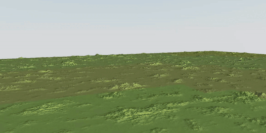

# Terrain CDLOD

This project demonstrates a basic implementation of terrain using Continuous Distance-Dependent Level of Detail (CDLOD). CDLOD continuously morphs vertices between LODs depending on their distance from the camera. This creates smooth transitions between LODs and automatically handles seams between tiles with different LODs.

[Demo](https://tschie.github.io/terrain-cdlod)

The implementation is intentionally kept minimal to focus on the quadtree node selection process and morphing in the vertex shader. It omits several features and optimizations likely found in a complete implementation. 

The frustum culling also does not take height into account, so you may notice some holes near the edge of the screen.

## Usage

Fly the camera using WASD. Click and drag to point camera. As you fly around, tiles will update their resolutions. 

Check the wireframe box to visualize the tiling. Uncheck to see that there are no seams between tiles.

## Run Locally

1. Clone the repository.
2. In the root directory, run `npm install`.
3. Run `npm run dev`.
4. Open browser to localhost:3000.

## References

- https://aggrobird.com/files/cdlod_latest.pdf
- https://svnte.se/cdlod-terrain
